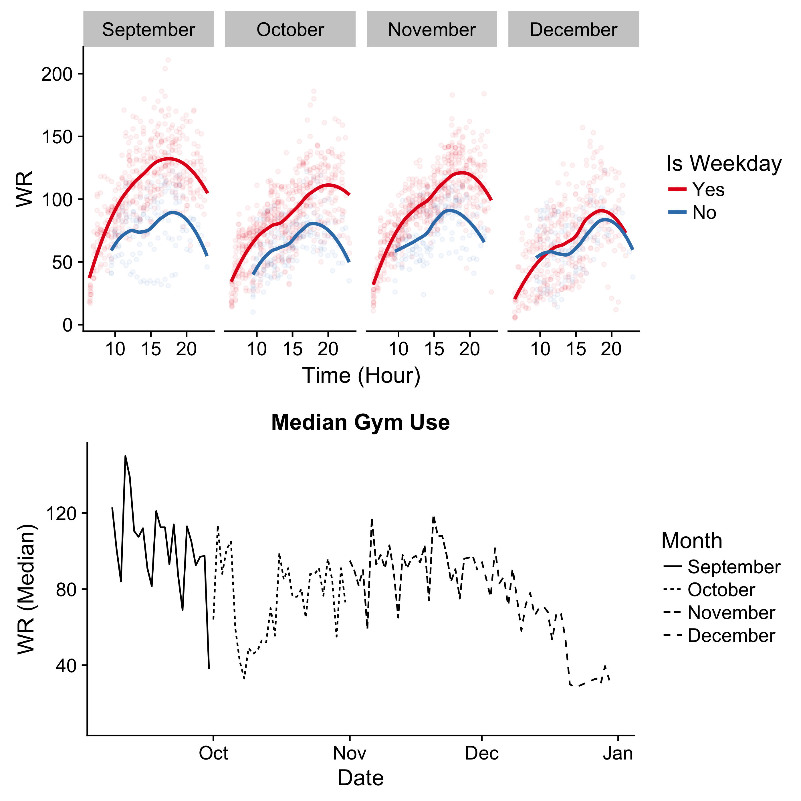
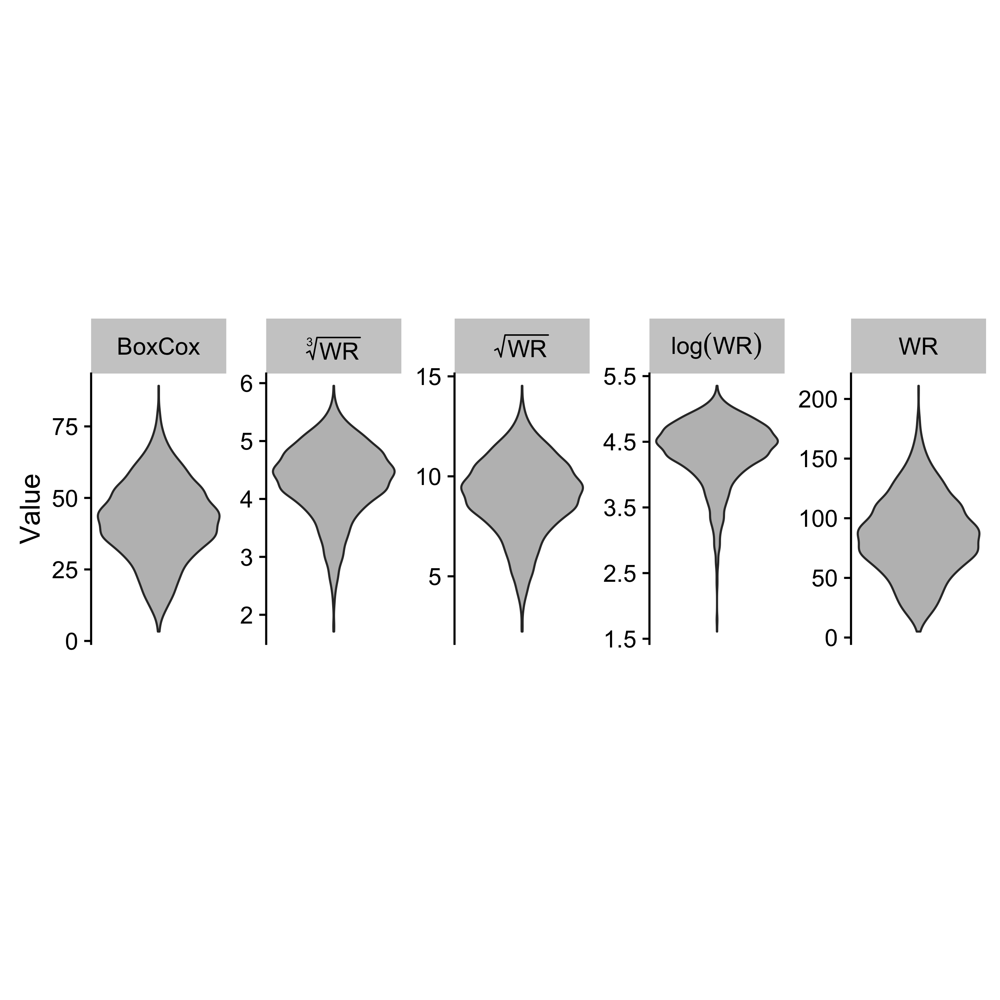
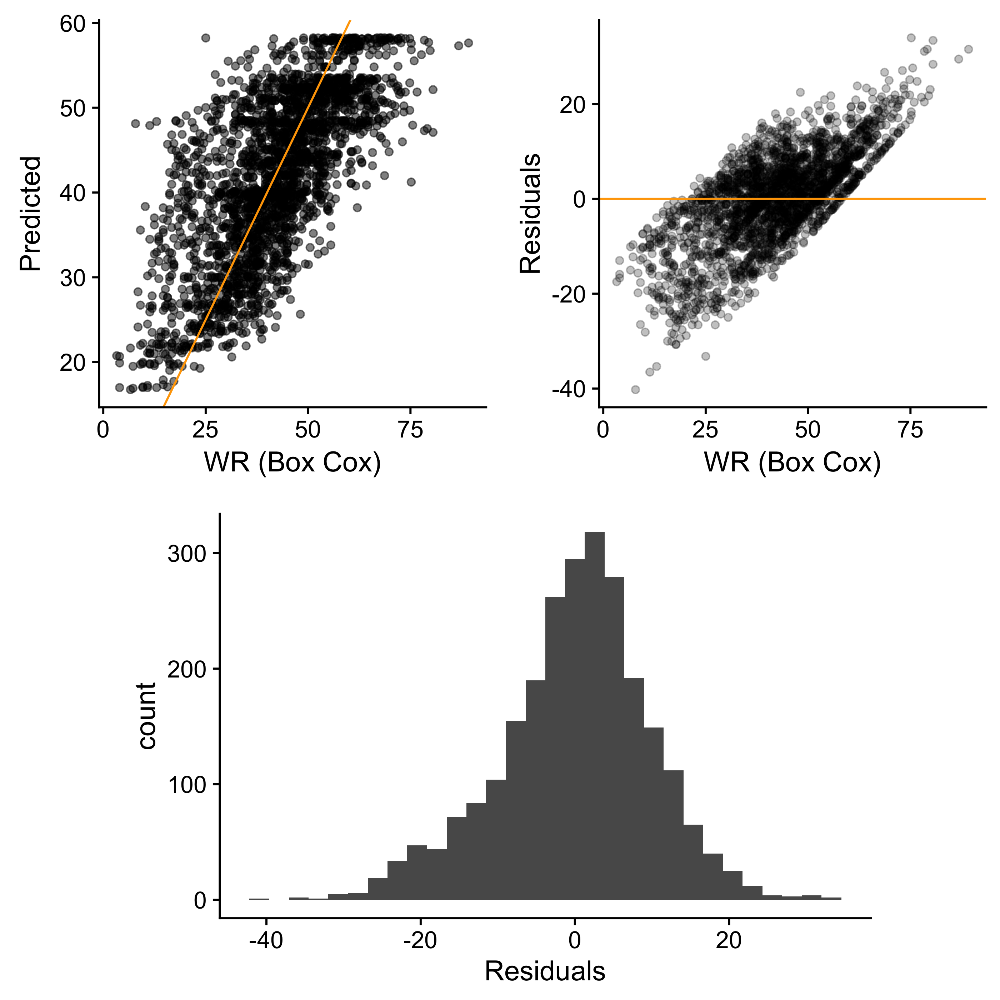
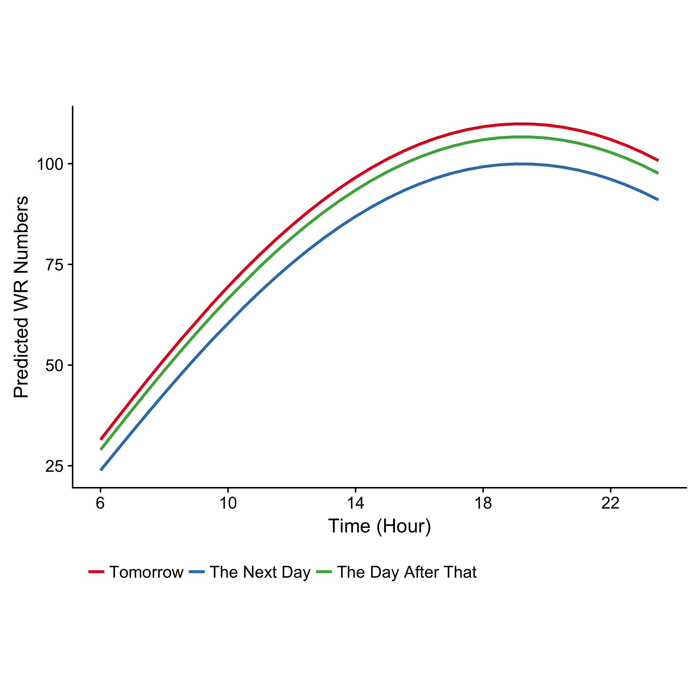

The following is a hobby project that turned into a class assignment, which earned me a class mark of 100%.  Pretty proud of that one.  Want to see the code?  Check out the R notebook on my [Github](https://github.com/Dpananos/GymBo)!


## Introduction

No one likes a crowded gym, so information about gym usage is essential for patrons.  Fortunately, Western's Rec Centre [tweets out how many students are currently in the weight room and cardio mezzanine](https://twitter.com/WesternWeightRm?lang=en) throughout the day.  Though useful to instantaneously get an estimate of usage, the tweets hold no predictive power.  A predictive model of gym usage would be valuable to students wanting to plan a workout as well as gym management looking to effectively allocate labour. 


Generating a predictive model is a tall order, and so in this project we take only the first step.  Tweets are scraped from the gym's twitter account and temporal trends are examined to attempt to understand how the gym is being used over time.  Feature engineering for time series machine learning is also performed with the aid of the `timetk` library.  A modest model is created using linear regression and turned into a tweeting robot. For now, we'll focus on data pertaining to the weight room as a proof of concept.

#Obtaining and Extracting Usage 

The Western Rec Centre operates a twitter account which periodically tweets out how many students are in the weight room and cardio mezzanine.  Recent tweets are easily accessed through the `twitteR` library.  A set of keys is required to access the API.  Once keys are obtained, the last 3200 tweets from any given account are available to users.  The API returns various metadata about the tweets made.  Of particular interest are the tweet text, the date created, and the unique id assigned to the tweet (this will become valuable for storing tweets in a sqlite database for posterity). 

The tweets are in english and though while consistent, may not always be in a dependable format. Using the library `stringr`, a heuristic is followed to determine the number of students in the weight room.  The twitter account usually uses 'WR' to indicate 'Weight Room', so the script will parse the tweets for the occurance of 'WR' in the tweet.  If 'WR' is in the tweet (accounting for capitalization, puncuation, etc), then the script will extract the largest integer present in the tweet and use this as the number of students in the weight room (the weight room ususally has more patrons than the cardio mezzanine.  This is the heuristic).  If neither an integer nor 'WR' appear in the script, -1 is returned.  This data is written to a sqlite database with the unique identifier used as the primary key.  The table shown below is a sample of what the database contains.


```r
  #keys.RDS is a data.frame housing:
  # -Consumer Key
  # -Consumer Secret
  # -Access Token
  # -Access Secret
  #
  # If you choose to obtain keys to access the API on your own, then
  # uncomment the code below and paste in your keys
  
  #--------------------------UNCOMMENT IF YOU HAVE KEYS-------------------------------
  # keys<- data.frame(
  #                   consumer_key = YOUR_CONSUMER_KEY,
  #                   consumer_secret = YOUR_CONSUMER_SECRET,
  #                   access_key = YOUR_ACCESS_KEY,
  #                   access_secret = YOUR_ACCESS_SECRET
  #                 )
  # 
  # saveRDS(keys,'keys.RDS')
  # remove(keys)


if(file.exists('keys.RDS')){
  
  keys<-readRDS('keys.RDS')
  
  #Authenticate with twitter and your keys
  twitteR::setup_twitter_oauth(
                                consumer_key = keys$consumer_key[1],
                                consumer_secret = keys$consumer_secret[1],
                                access_token = keys$access_key[1],
                                access_secret = keys$access_secret[1]
                                )
  
  #Gym's account is WesternWeightRm.  Get the tweets with this command. 3200 is limit
  gym.tweets = twitteR::userTimeline('WesternWeightRm',n = 3200) %>%
               twitteR::twListToDF()
  
  #Create function to extract the weight room
  get.wr<- function(x){
    #Ensure all words are lower for consistency
    words<- str_to_lower(x) %>% 
            str_split(boundary('word')) %>% 
            unlist
    if('wr' %in% words){
      #Here is heuristic.  WR and integer must be in tweet
      number<- words %>% 
               str_match_all("[0-9]+") %>% 
               unlist %>%
               as.numeric %>% 
               max
    }else{
      number = -1
    }
      return(number)
  }
  
  #Select only the columns I really care about  
  tweet.data0<-gym.tweets %>% 
            select(
                    text,
                    created,
                    id
                  ) 
  
  #Clean up the time zones and apply my function to extract the WR
  tweet.data = tweet.data0 %>% 
               mutate(
                      created = ymd_hms(created, tz = 'UTC') %>% with_tz(tzone = 'America/Toronto') %>% as.character(),
                      WR  = purrr::map_dbl(text,get.wr) 
                    ) %>% 
              filter(
                      created>='2017-09-01'
                      )
  
  #Connects to database housing historic tweets.  Will update db with new tweets.
  db = dbConnect(SQLite(),'WRDB.sqlite3')
  old.data = dbReadTable(db,'WeightRoom')
  new.data = tweet.data %>% anti_join(old.data,'id')
  dbWriteTable(db,'WeightRoom', new.data, overwrite = F, append = T)
  dbDisconnect(db)
  
}
```

```
## [1] "Using direct authentication"
```


```r
con <- dbConnect(SQLite(), 'WRDB.sqlite3')
gym.tbl <-tbl(con,'WeightRoom') 

gym.data<-gym.tbl %>% 
          select(WR,created) %>% 
          collect() %>% 
          mutate(created = ymd_hms(created)) %>% 
          tk_augment_timeseries_signature() %>% 
          mutate(
                date = date(created),
                time = hour+minute/60,
                is.weekday = if_else(wday.lbl %in% c('Saturday','Sunday'),'No','Yes') %>% factor(levels =c('Yes','No'), ordered = T)
               ) %>% 
          filter(date>'2017-09-07', year(date)==2017 )

print.out<-gym.tbl %>%
          collect()%>%
          select(id,created,text,WR) %>% 
          head()

dbDisconnect(con)


print.out %>% 
  kable('html') %>% 
  kable_styling()
```

<table class="table" style="margin-left: auto; margin-right: auto;">
<thead><tr>
<th style="text-align:left;"> id </th>
   <th style="text-align:left;"> created </th>
   <th style="text-align:left;"> text </th>
   <th style="text-align:right;"> WR </th>
  </tr></thead>
<tbody>
<tr>
<td style="text-align:left;"> 924416733640888320 </td>
   <td style="text-align:left;"> 2017-10-28 19:24:58 </td>
   <td style="text-align:left;"> WR 65 CM 16 </td>
   <td style="text-align:right;"> 65 </td>
  </tr>
<tr>
<td style="text-align:left;"> 924409455080607745 </td>
   <td style="text-align:left;"> 2017-10-28 18:56:03 </td>
   <td style="text-align:left;"> WR 86 CM 19 </td>
   <td style="text-align:right;"> 86 </td>
  </tr>
<tr>
<td style="text-align:left;"> 924397559849848833 </td>
   <td style="text-align:left;"> 2017-10-28 18:08:47 </td>
   <td style="text-align:left;"> WR 102 CM 27 </td>
   <td style="text-align:right;"> 102 </td>
  </tr>
<tr>
<td style="text-align:left;"> 924380444614909953 </td>
   <td style="text-align:left;"> 2017-10-28 17:00:46 </td>
   <td style="text-align:left;"> WR 122 CM 47 </td>
   <td style="text-align:right;"> 122 </td>
  </tr>
<tr>
<td style="text-align:left;"> 924373350629199872 </td>
   <td style="text-align:left;"> 2017-10-28 16:32:35 </td>
   <td style="text-align:left;"> 114 WR &amp;amp; 39 CM </td>
   <td style="text-align:right;"> 114 </td>
  </tr>
<tr>
<td style="text-align:left;"> 924366703332614145 </td>
   <td style="text-align:left;"> 2017-10-28 16:06:10 </td>
   <td style="text-align:left;"> 80 WR &amp;amp; 38 CM </td>
   <td style="text-align:right;"> 80 </td>
  </tr>
</tbody>
</table>


## Extracting Important Time Features

We are primarily interested in day to day changes in the number of students.  However, there may exist dynamics on the time scale of weeks, or months, that we would miss by only considering day to day or hour to hour trends.  For this reason, we leverage the use of `timetk` to extract other time information.  Doing so produces a dataframe with many columns, several of which are redundant.  Here, we choose just a few which we believe to be of particular importance to the problem.  In particular, we extract: weekday, day of year, month, week of month, week of year.  We also create feautures for time, date, if the day is a weekend, if the day has any particular significance (e.g. Homecoming or Holidays), and the number of days until the significant days end (for instance, the Saturday of Thanksgiving has a value of 3 since there are 3 days until school starts again).


```r
#Homecoming thrown by students
faux.co <- date('2017-09-30')
faux.co <- data.frame(date = faux.co, remaining = rev(c(1:length(faux.co))))

#Thanksgiving and Fall reading week
thanksgiving.and.break <- seq(date('2017-10-06'),date('2017-10-15'), by = 'days')
thanksgiving.and.break <- data.frame(date = thanksgiving.and.break, remaining = rev(c(1:length(thanksgiving.and.break))))

#Bind them together
is.special= bind_rows(faux.co, thanksgiving.and.break) %>% mutate(is.special = 1)


gd<-gym.data %>% 
    select(
            WR,
            created,
            time,
            date,
            wday.lbl,
            yday,
            is.weekday,
            month.lbl,
            mweek,
            week
          ) %>% 
    left_join(is.special, on = date) %>% 
    filter(WR>0)

#Join performed in last step yields NA since it is a left join.  Fills those in.
gd[is.na(gd)] = 0

#Convert is special to Yes/No for plotting
gd<- gd %>% 
      mutate(
              is.special = if_else(is.special==1,'Yes','No') %>% factor(levels = c('Yes','No'), ordered = T)
            )

gd %>% 
  head() %>% 
  kable('html') %>% 
  kable_styling()
```

<table class="table" style="margin-left: auto; margin-right: auto;">
<thead><tr>
<th style="text-align:right;"> WR </th>
   <th style="text-align:left;"> created </th>
   <th style="text-align:right;"> time </th>
   <th style="text-align:left;"> date </th>
   <th style="text-align:left;"> wday.lbl </th>
   <th style="text-align:right;"> yday </th>
   <th style="text-align:left;"> is.weekday </th>
   <th style="text-align:left;"> month.lbl </th>
   <th style="text-align:right;"> mweek </th>
   <th style="text-align:right;"> week </th>
   <th style="text-align:right;"> remaining </th>
   <th style="text-align:left;"> is.special </th>
  </tr></thead>
<tbody>
<tr>
<td style="text-align:right;"> 27 </td>
   <td style="text-align:left;"> 2017-09-08 06:30:18 </td>
   <td style="text-align:right;"> 6.500000 </td>
   <td style="text-align:left;"> 2017-09-08 </td>
   <td style="text-align:left;"> Friday </td>
   <td style="text-align:right;"> 251 </td>
   <td style="text-align:left;"> Yes </td>
   <td style="text-align:left;"> September </td>
   <td style="text-align:right;"> 2 </td>
   <td style="text-align:right;"> 36 </td>
   <td style="text-align:right;"> 0 </td>
   <td style="text-align:left;"> No </td>
  </tr>
<tr>
<td style="text-align:right;"> 37 </td>
   <td style="text-align:left;"> 2017-09-08 06:59:40 </td>
   <td style="text-align:right;"> 6.983333 </td>
   <td style="text-align:left;"> 2017-09-08 </td>
   <td style="text-align:left;"> Friday </td>
   <td style="text-align:right;"> 251 </td>
   <td style="text-align:left;"> Yes </td>
   <td style="text-align:left;"> September </td>
   <td style="text-align:right;"> 2 </td>
   <td style="text-align:right;"> 36 </td>
   <td style="text-align:right;"> 0 </td>
   <td style="text-align:left;"> No </td>
  </tr>
<tr>
<td style="text-align:right;"> 66 </td>
   <td style="text-align:left;"> 2017-09-08 07:30:14 </td>
   <td style="text-align:right;"> 7.500000 </td>
   <td style="text-align:left;"> 2017-09-08 </td>
   <td style="text-align:left;"> Friday </td>
   <td style="text-align:right;"> 251 </td>
   <td style="text-align:left;"> Yes </td>
   <td style="text-align:left;"> September </td>
   <td style="text-align:right;"> 2 </td>
   <td style="text-align:right;"> 36 </td>
   <td style="text-align:right;"> 0 </td>
   <td style="text-align:left;"> No </td>
  </tr>
<tr>
<td style="text-align:right;"> 70 </td>
   <td style="text-align:left;"> 2017-09-08 08:01:09 </td>
   <td style="text-align:right;"> 8.016667 </td>
   <td style="text-align:left;"> 2017-09-08 </td>
   <td style="text-align:left;"> Friday </td>
   <td style="text-align:right;"> 251 </td>
   <td style="text-align:left;"> Yes </td>
   <td style="text-align:left;"> September </td>
   <td style="text-align:right;"> 2 </td>
   <td style="text-align:right;"> 36 </td>
   <td style="text-align:right;"> 0 </td>
   <td style="text-align:left;"> No </td>
  </tr>
<tr>
<td style="text-align:right;"> 71 </td>
   <td style="text-align:left;"> 2017-09-08 09:02:18 </td>
   <td style="text-align:right;"> 9.033333 </td>
   <td style="text-align:left;"> 2017-09-08 </td>
   <td style="text-align:left;"> Friday </td>
   <td style="text-align:right;"> 251 </td>
   <td style="text-align:left;"> Yes </td>
   <td style="text-align:left;"> September </td>
   <td style="text-align:right;"> 2 </td>
   <td style="text-align:right;"> 36 </td>
   <td style="text-align:right;"> 0 </td>
   <td style="text-align:left;"> No </td>
  </tr>
<tr>
<td style="text-align:right;"> 69 </td>
   <td style="text-align:left;"> 2017-09-08 09:30:13 </td>
   <td style="text-align:right;"> 9.500000 </td>
   <td style="text-align:left;"> 2017-09-08 </td>
   <td style="text-align:left;"> Friday </td>
   <td style="text-align:right;"> 251 </td>
   <td style="text-align:left;"> Yes </td>
   <td style="text-align:left;"> September </td>
   <td style="text-align:right;"> 2 </td>
   <td style="text-align:right;"> 36 </td>
   <td style="text-align:right;"> 0 </td>
   <td style="text-align:left;"> No </td>
  </tr>
</tbody>
</table>


## Plots of Trends

The time features allow examination of usage trends at several granularities.  Examining the trends on a monthly level shows a clear change in students's behaviour as the semester progresses.  In September, the peak gym usage occurs somewhere between 5 PM and 7PM.  As the months progress, peak usage occurs later, somewhere around 8 PM.  

September seems to be the busiest month for the gym.  One possible explanation is that in this month, patrons are free of assignments and other responsibilities and may be free to go to the gym.  As the semester progresses, responsibilitie pile, and they may be less inclined to go.  October sees the coming and passing of midterms as well as the fall reading break. This makes October the month with the least usage.  Granularity can be further increased to the level of weekday.  Monday sees the largest temporal shift in peak use from the evening to late night, where as the middle weekdays see no shift in temporal peek use.  Friday's 
temporal peak use regresses in October (likely due to exams) and then shifts to later in the evening in November.  Weekends see no drastic shifts in temporal peak use.


```r
mp<-gd %>% 
  group_by(date) %>%
  summarise(weight.room = median(WR)) %>% 
  ggplot(
        aes(date,weight.room, linetype = month(date,label = T, abbr = F))
        ) +
  geom_line()+
  labs(title = 'Median Gym Use', x = 'Date', y = 'WR (Median)', linetype = 'Month')+
  scale_color_brewer(palette = 'Set1')+
  ylim(10,NA)


p1<-gd %>% 
    ggplot(aes(time,WR, color = is.weekday)) +
    geom_point(alpha = 0.05, size = 1)+
    geom_smooth(se = F)+
    facet_wrap(~month.lbl, nrow = 1)+
    scale_color_brewer(palette = 'Set1')+
    labs( x = 'Time (Hour)', y = 'WR', color = 'Is Weekday')


plot_grid(p1, mp, labels = NULL, ncol = 1, align = 'v', axis = 't')
```




## Modelling Considerations

There are several considertions to be made before modelling the process can begin.  The first is that prediction for this specific problem is essentially a time series problem. However the times between observations are not uniformly spaced. The gym seems to try to tweet every thirty minutes, but on the rare occasion is delayed upwards of 50 minutes.  Observations could be rounded to the nearest hour or half hour in order to account for this. A summary statistic could also be chosen to be applied to all dates (e.g. the median), and this summary statistic could be forcasted through the use of time series methods.

The WR variable is highly autocorrelated and heteroskedastic.  The heteroskedasticity can be dealt with by applying a transformation to the data.  Shown in the figure below is a series of transformations one might apply, with the most effective transformation being the Box Cox Power Transformation.

Lastly, if time series are not to be used, a typical train/test split is not the best approach for obtaining cross validated predictive accuracy since the observations are not independant.  Instead, a "walk forward" validation may be more appropriate.  Such methods are implemented in most machine learning libraries, such as R's `caret`.


```r
BCX = MASS::boxcox(gd$WR~1, plotit = F)

ix = which.max(BCX$y)

lambda = BCX$x[ix]


gdg<-gd %>% 
  select(WR) %>% 
  mutate(
          logWR = log(WR),
          sqrtWR = sqrt(WR),
          crtWR = WR^(1/3),
          bcWR = (WR^lambda-1)/lambda
        ) %>% 
  gather(Transform,Value) %>% 
  mutate(Transform = as_factor(Transform) 
         )

gdg %>% 
  ggplot(aes(factor(1),Value))+
  geom_violin(fill = 'gray')+
  facet_wrap(~ordered(Transform, 
                       levels = levels(gdg$Transform) %>% rev,
                       labels = c('WR', 'log(WR)', 'sqrt(WR)','sqrt(WR,3)','BoxCox') %>% rev),
              scales = 'free',
              labeller=label_parsed,
             nrow = 1)+
  labs(x = '')+
  scale_x_discrete(breaks = NULL)+
  theme(aspect.ratio = 2)
```



## A Modest Attempt at Modelling

In this section, we take a very modest approach to predictive modelling using a linear model and the `caret` package.  Statistical inference may be effected by the correlation of the observations, and so we do not consider any coefficients or hypothesis tests.  Instead, performance is measured by cross validated predictive power, in particular the the MAE.

The final model only accounts for day of the week and time of day.  Shown below are some regression diagnostic plots.


```r
set.seed(19920908)

#BoxCox Transform
gd['bcWR'] = (gd$WR^lambda -1)/lambda


#Remove ordering from factors
gd <- gd %>% 
      mutate_if( is.ordered,function(x) factor(x, ordered = F))


#Train Control Methods
myTimeControl<- trainControl(method = 'timeslice',
                             initialWindow = 25*14,
                             horizon = 25,
                             fixedWindow = T
                            )

#Fit a model  + wday.lbl + yday
lm.time = train(bcWR ~ poly(time,2),
              data= gd,
              method = 'lm',
              trControl = myTimeControl
              )

lm.weekday =lm.time = train(bcWR ~ poly(time,2)+ wday.lbl,
              data= gd,
              method = 'lm',
              trControl = myTimeControl
              )

lm.interaction =lm.time = train(bcWR ~ poly(time,2)*wday.lbl,
              data= gd,
              method = 'lm',
              trControl = myTimeControl
              )
```


```r
gd['predicted'] = predict(lm.weekday, gd)
gd['resid'] = (gd$bcWR - gd$predicted)


preds<-gd %>% 
  ggplot(aes(bcWR,predicted))+
  geom_point(alpha = 0.5)+
  geom_abline(color = 'orange')+
  theme(aspect.ratio = 1)+
  labs(x = 'WR (Box Cox)',y = 'Predicted')

resids<-gd %>% 
        ggplot(aes(bcWR, resid))+
        geom_point(alpha = 0.25)+
        geom_hline(aes(yintercept = 0), color = 'orange')+
  labs(x = 'WR (Box Cox)',y = 'Residuals')+
  theme(aspect.ratio = 1)

  

hist.er = gd %>% 
          ggplot(aes(resid))+
          geom_histogram()+
          labs(x = 'Residuals')+
          theme(aspect.ratio = 1/1.61)

top_row = plot_grid(preds, resids, labels =NULL, ncol = 2, align = 'v', axis = 'h')

plot_grid(top_row, hist.er, labels = NULL , nrow = 2, align = 'l', axis = 'l')
```




## Making Predictions

Making future predictions is impressively easy with `caret` and `timetk`.  Simply pass the time features into `timetk`'s function `tk_make_future_series` and the library will return an array with future observation times spaced by the mean difference in the observed times (in our case that is very close to half an hour, but just slightly larger.  We can round the times to the nearest half hour using lubridate).  Passing those times into the `tk_augment_timeseires_signature` function will return appropriate time feautures we used for modelling, and then a small mutate to include our unique features finishes the job.

Shown below is a plot of predictions for the next three days.

```r
idx = tk_index(gd)

future_series = data.frame( created =tk_make_future_timeseries(idx, n_future = 1000) )

future_series = future_series %>% 
                mutate(created = round_date(created, '30 mins')) %>% 
                filter(
                        between(date(created),today() + days(1) ,today()+ days(3)),
                        between(hour(created),6,23)
                        ) %>% 
                tk_augment_timeseries_signature() %>% 
                mutate(
                        date = date(created),
                        time = hour+minute/60,
                        is.weekday = if_else(wday.lbl %in% c('Saturday','Sunday'),'No','Yes') %>% factor(levels =c('Yes','No'), ordered = T),
                        day.lbl = case_when(
                                            date== today()+days(1)~'Tomorrow',
                                            date== today()+days(2)~'The Next Day',
                                            date== today()+days(3)~'The Day After That',
                                            ) %>% factor(levels = c('Tomorrow','The Next Day','The Day After That'), ordered = T)
                       ) 

future_series['predictions'] = predict(lm.weekday,newdata = future_series)
future_series['predictions'] = (lambda*future_series$predictions +1)^(1/lambda)

future_series %>% 
  ggplot(aes(time,predictions))+
  geom_line(aes(color = day.lbl,group = day.lbl), size = 1)+
  scale_color_brewer(palette = 'Set1')+
  labs(x = 'Time (Hour)', y = 'Predicted WR Numbers',color = '')+
  theme(aspect.ratio = 1/1.61)+
  scale_x_continuous(breaks = seq(6,24,by = 4) )+
  scale_y_continuous(breaks = seq(0,150,by = 25))+
  theme(legend.position = 'bottom')
```



## Conclusions, Discussion, and Next Steps

The model is far from ideal. The residuals from the regression exhibit correlation, are ever so slightly positvely skewed, and the model can not account for sudden drops in usage due to holidays, exams, etc.  Furthermore, time is not the only variable that is informative for gym usage.  Weather (either too hot or too cold, the probability of precipitation, etc) has an enormous impact on gym usage, but as of now no weather data has been captured.  Including data on month or if the day is "special" often results in zero variance features for most window lengths, and so the impact of these features are hard to estimate using the methods implemented for this particular model.  Information on class schedules may also be useful.  It could be the case that sporadic increases in gym usage are due to classes letting out, or that dips in usage are due to the start of large classes.  The impact of class scheduling is purely conjecture at this moment.


None the less, the model serves as an indicator of what gym usage possible could be, and is certainly better than instantaneously guessing what gym usage will be like in the coming hours.  The model has been implemented as a twitter accont and tweets out predictions each day approximately every hour.  Since the tweets are made automatically, this qualifies the account as a "bot".  This bot is named **GyMbo** (a homonym of the male name Jimbo and portmanteau of Gym Monitoring Robot) and is implemented in python.  Readers can follow the bot at @WesternGymBot.


